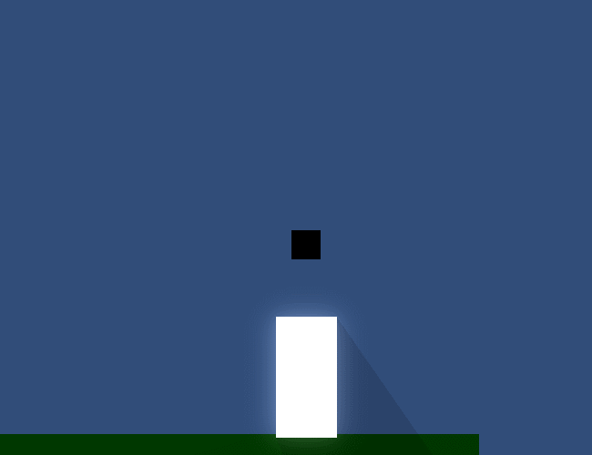

This is development week four out of eighteen for Glass Bubble. The previous week's devlog can be found [here](20140727000835.md).

It may be noted that these devlogs usually come out late, since it is technically time for week five's work by now. I am running a little behind schedule and I hope I will catch up this week as some of the work was done in a previous week.

I somehow finished the dialog system! You can see a short demo of it below:

I had to make a lot of terrible hacks to make this work, and it's caused me to think of better ways to handle the way my Ren'Py importer works. After this project is finished, I plan on going back and improving the API of the plugin so that it's easier to display the dialog in different ways.

I tried to make it easier to tell what has been said, what has just been said, and who said what lines. It's still difficult to read what's going on, and I feel like most of this would be corrected if I had transitions to show the text moving around.

Menus, especially, are difficult to differentiate from the rest of the dialog. I may try to rectify this problem in the future by adding padding or a horizontal rule element, but I'm not sure yet.

Next week I'll be writing the dialogs for Grim and Kelsi. I wish I had more time to make the dialog system work better, but since it is working I'll move on.
