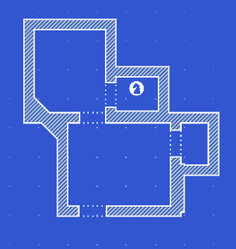

> [!info]
> This post was originally intended for a [Patreon](../tags/patreon.md) audience.

# Pathfinding

I've been pretty busy lately with Hurricane Harvey and applying for a potential contract. Those are all "fun" and everything, but I finally got back to working on Access, which is great.

I finished working on pathfinding so you can move characters between rooms.



The psuedocode for the algorithm is pretty simple: It does a depth-first search for a potential path, then selects the shortest one.

The code for interpolating along the path is a little more complicated. First, I make a cache of how far along each way point on the path is and then save the total length of the path. With an interpolation value _t_, I can find out how far along the path I need to be, which I'll call _d_. Once I have that, I need to find the two way points with cached distances that contain _d_. Then, I have to recalculate _t_ so that I can linearly interpolate between the two way points for the final result. This is kind of hard to imagine just from reading, so I included some code below:

```cs
var distance = totalDistance * t

var index = 0;
for (int i = 1; i < distances.Length; ++i)
{
    if (distance <= distances[i])
    {
        index = i;
        break;
    }
}

// Calculate new t
var min = distances[index - 1];
var max = distances[index];
t = (distance - min) / (max - min);

return Vector2.Lerp(waypoints[index - 1], waypoints[index], t);
```

For now, pathfinding only works when invoked through a script so I can control the movement of characters on the screen during dialog. I will be adding GUI controls and "Access" information next.
