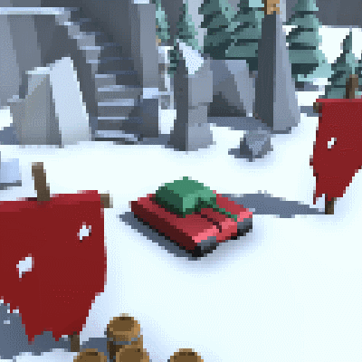

> [!info]
> This post was originally intended for a [Patreon](../tags/patreon.md) audience.

# Initial Tankmeld Development

Starting the development of Tankmeld (around September 4th) was pretty straightforward. The very first thing I did was create a Tank model, which was a rather lengthy process.

At first, I wasn't really sure what I was doing. I've had some experience making models in blender before, but I wasn't sure where to start. After looking up some examples, I ended up making the tank treads first.

They looked kind of OK, so I started to put... tread shields? Is that what those are called? Then I tried putting the body on the treads, but the resulting body looked really fat and kind of weird so I kept resizing and re-positioning the treads to fit. Eventually, I arrived at something kind of acceptable?

It looks mostly about a tank, so I guess that's fine. I could have also just used tank models or pre-made tank packages from the Unity store, but I wanted very specific control over tank movement and animation, so I opted to just make it.

After making the tank model, I wrote a movement script and looked up some low poly asset packages on the Unity asset store. I also spent some time tinkering with post-processing effects to get an appearance I liked.

It was starting to feel like a game, and this close-up gif of the tank movement is rather non-representative of how the camera in Tankmeld would work. Tankmeld has to show four people at the same, so the camera is much farther away, which means the tank is much less defined. However, this gif made me feel like making a tank campaign, which is a cool idea I might do sometime.

Afterwards, I scripted individual systems one-by-one. After the movement script, I worked on aiming and firing the turret. Then, I implemented scoring and respawning.

The end result is a very _very_ basic gameplay loop. You can move your tank around, kill enemies, respawn, and see your team's score. It's really rather boring, but hey - it works! Now I can spend the rest of the time making the game more juicy and fun, which is a really fun step.

If you wanted to be bored to death, or if you just wanted to check out what I've done so far, I've [attached demos to this post](https://www.patreon.com/posts/14330139). You'll need Xbox360 controllers to play. The left analog stick moves your tank, left and right triggers rotate your _partner's_ tank, and the A button shoots a shell. You get 1 point for killing an enemy, -1 point for killing your teammate, and the game never ends.
