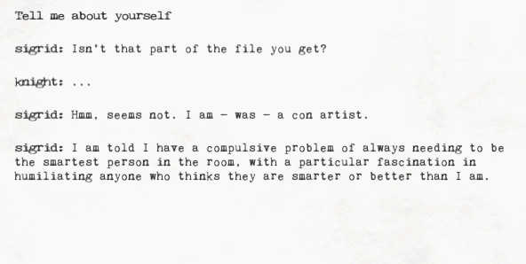

> [!info]
> This post was originally intended for a [Patreon](../tags/patreon.md) audience.

# Injecting Dialog at Runtime in Access


I spent most of the last few days working on Access. As you can see from the cover image, I decided to change from 2D to 3D (which wasn't terribly hard, since [the rooms were 3D already](201708192200.md)). Also, now we've got pretty things like trees:


And fancy-smancy typewriter screenplay dialog:



Anyway, enough with the updates.

---

I'm here to talk about how I inject dialog in Access and why I need to do it. This will also require a brief explanation of how Rumor, the scripting language I made for dialog, works.

In Access, when you talk to a person, you get several dialog options.


So that's fine, you know, that seems normal, but wait, what about that last bit? The "Ask about" bit?


Huh, that's a lot of options.


Uh...


Oh.

If you haven't caught on yet, you're basically allowed to ask each character any number of things about, well, relationships. Part of the reason this is even here is because I'm trying to make an effort to not suggest answers to the player (see: [What Makes a Good Detective Game?](https://www.youtube.com/watch?v=gwV_mA2cv_0)).

This is kind of a big problem, because how do you store all of this information? One way is to store all of the relationships in the same script.

```
label sigrid_relationship_with_inge:
    say "hello world"

label sigrid_relationship_with_rasmus:
    say "foobar"
```

Later, in code, we can jump to a specific label based on what was selected.

What kind of sucks about this though is that eventually your main script will become so humongous that it could be difficult to find anything. So, what if we split all of the relationship dialog into separate files?


Well, that's better. The only problem now is that we'll have to stop the character's dialog, start the relationship dialog, and then start the original dialog again, and somehow magically jump back to where we were.

Typically as far as I know, in narrative frameworks such as Twine or Ren'py, you actually would have to do what I just suggested (actually, if we're being completely honest, you'd probably do the first suggestion with the labels or use includes because its easier). This is because they work with the assumption that you'll write _**all**_ the dialog, compile the game, and _**then**_ run it. They don't expect you to say, suddenly have a life crisis and load some random file off the disk after the game has already been compiled and do whatever it says. In fact, it doesn't really make any sense, why would you do that?

When I created Rumor, I made the assumption that I won't know what the dialog is before I compile the game. This means we can compile scripts on the fly and this feature will actually give us the flexibility to perform injection.

```cs
public void Start()
{
    var script = GetFile().ReadAllText();
    var rumor = new Rumor(script);
    StartCoroutine(rumor.Rum());
}
```

In this psuedocode example, `GetFile` can literally get a file from anywhere, like from the disk, or from a webserver, or whatever. Hell, it could even procedurally generate dialog on the fly (this is what I plan to do for my haiku game).

When I create a new Rumor, all I do is compile the script into a list of nodes organized into stack frames. This means if I want to suddenly inject more content at a moments notice, all I have to do is compile a script into nodes, stick it in a stack frame, and push it onto the stack.

```cs
public void SometimeLater()
{
    var script = GetFile().ReadAllText();
    var nodes = new RumorCompiler().Compile(script);
    rumor.Inject(nodes);
}

// Rumor.cs

public void Inject(IEnumerable<Node> nodes)
{
    stack.Push(new StackFrame(nodes));
}
```

Now, we don't even need to stop the dialog! We can trivially insert more content whenever we want. In fact, I even abuse this to remove the requirement for some boilerplate code.

When you pick a choice, a page flip sound is played, but you can't hear it because Rumor will immediately start the next line of dialog, which uses a typewriter sound as the dialog is displayed. So, when I pick a choice, I inject a pause.

```cs
// Inject a pause for the page flip sound
var nodes = new RumorCompiler().Compile("pause 1")
report.Rumor.Inject(nodes);

pageFlipSounds.PlayOneShot();
```

That's pretty great, huh? It used to be that I'd have to sit down with a writer and be like, ok, well, you need to write `pause 1` right after every choice, because, well you see, we have this page turning sound? And don't forget to put it in because I'd really hate to have to check every file manually and make sure it's there...

Or, alternatively, I could write some clunky, cumbersome coroutine to pause execution of Rumor for a bit. I don't really want to do that either. It sounds like spaghetti.

Anyway, yeah, injecting dialog is cool. I've never seen any other dialog engine give you this capability, so I'm pretty happy with what I've accomplished here.
