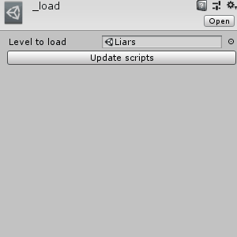

> [!info]
> This post was originally intended for a [Patreon](../tags/patreon.md) audience.

# The `_load` script

So it used to be that in order to load all of the files needed for a level, I needed to update a text script called `_load` manually. This is due to some really awkward Unity API design, but it started to get really... tedious.

This issue is compounded by the fact that our game has a ton of small, tiny little dialogues littered pretty much for almost anything relevant a player can ask.

So, I wrote a tool.

Nice.

Whenever I write a tool I inevitably wonder why I didn't do so sooner...
