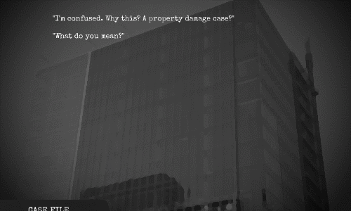

> [!info]
> This post was originally intended for a [Patreon](../tags/patreon.md) audience.

# Access Rehaul

After finishing my contracting work, I've been able to focus my full attention again on Access.

I noticed several problems with how I wrote the code. In particular, there were many places where I introduced unnecessary state that made things hard to understand when trying to add new features or get rid of bugs. Normally, I would avoid state as much as I can, but Unity makes it hard to know what the right balance is since it forces you to make so many bad design decisions when it comes to code.

So, I decided to rehaul the code again. Doing so has allowed me to implement some new features that would have been otherwise difficult to add. For example, now we can go forwards and backwards through the dialog:

I've also been able to add a new ui element for debugging, which will make it a lot easier to test the game while it is running.

I've also revamped the save system so it's easier to have multiple saves -- but since I don't have a UI for that, there isn't much to show for that.

The case file also looks a little different now:

It may not look like much, but a big design change has happened. It used to be that opening the case file would open the suspects file by default, and you could navigate to other pages by clicking on each suspect's portrait. But this seemed to be confusing and it made it more difficult to add more pages. Instead, you can now see a listing of all files you have obtained for that level and inspect them individually.

Now we won't have situations like having a tuning fork as one of the suspects and we can add many different things to the case file that aren't related to the suspects page!

I plan on finishing overworld where the player gets to explore the crime scene by the end of next week. It's a bit of a high goal, but I'm super excited to see it put together again, but in a better way like what I've done with this stuff.
