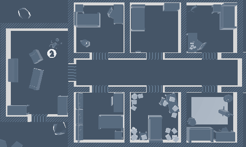
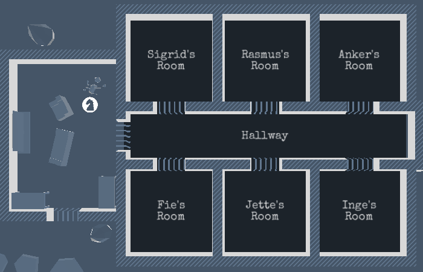

> [!info]
> This post was originally intended for a [Patreon](../tags/patreon.md) audience.

# Access Progress

There have been a lot of progress made to Access this month, despite being a little overwhelmed with life/work. I've been recording gifs of some of the re-implemented or completely new features, which you may have seen already if you've been hanging out on the discord channel.

Movement between rooms has been re-implemented! Something noteworthy about the new movement implementation is that it is _way_ more reliable. These problems that existed in the old version no longer exist:

- Changing the destination while moving causes the marker to glitch out before showing up in whatever destination was farthest from the marker
- Cannot choose destination when not in any rooms, which commonly happens in the gap between rooms

Fog of war was also re-implemented! The new implementation is slightly different from the original, as I've opted to name all the rooms in a blueprint-esque way. I'm hoping the text will actually help players remember what the rooms are better than with icons, which seems a little contradictory. We'll see what people think in the next playtest!

Something new I've added is the settings screen! Before the rehaul, you could only set accessibility settings when the game launched for the first time. In the future, I'd like the settings menu to also include graphics and sound options.

I've also added a new save slots interface! I ended up opting for three save slots instead of letting the player have an infinite number of saves as I think that would make the game feel more like a narrative game where your choices matter rather than some narrative structure a player has to exhaust all options of.

In general, I don't really approve of narrative games that encourage this kind of behavior but that's a post for another time. A hidden option to let players have an infinite amount of saves anyway could happen if there is demand for it, since the underlying code can handle an arbitrary number of saves.
