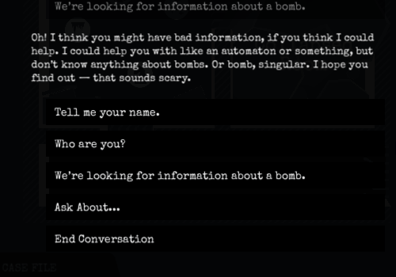
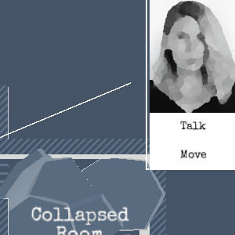
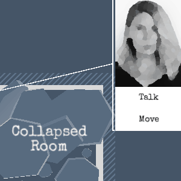

> [!info]
> This post was originally intended for a [Patreon](../tags/patreon.md) audience.

# Access & Unity Bugs

I've run into a couple of problems with Unity when trying to work on Access, which is often frustrating. Friends know I have a distaste for Unity and I often complain about its problems. Why do I use it? Well, it's the best option for me right now unfortunately. There are many alternatives to using Unity, but the option I would like to pursue the most -- to make my own game engine -- would take a lot of time of course.

These problems often cost me a lot of time (not to mention the time it takes to write a bug report), and the ones I mention in this post are just ones I have _solved_. I will often just avoid problems I encounter simply by deciding to do something else rather than try to figure out what's wrong with Unity.

Anyway, here are some issues I've run into:

# Jumping to the bottom of the dialog

This bug is something I've struggled with for a long time actually, ever since I first started working on Access. When you're talking to a person during a level, the dialog automatically scrolls down so you can see what they just said. Implementing this should be pretty straightforward and it seems that way since there is a property you can change, where 1 was the top of the content and 0 was the bottom. So, setting it to zero will work, right?

Nope. It's a little difficult to tell in the gif, but the bottom of the gif is actually the bottom of the screen. So, text gets cut off after you click and it gets very confusing. It seems like there is a combination of two things happening:

- The position is stored as an absolute value instead of as a relative value.
- The size and layout of all the elements is updated after I set the property to 0.

Unfortunately, the best solution I could figure out for a very long time still wasn't a complete fix; the position would be incorrect for exactly one frame before it corrected itself. It looked _terrible_. Thankfully, I miraculously stumbled upon some information that led me to a solution while looking up this problem after getting frustrated with it again.

I want to file a bug report for this, but I haven't yet gotten around it.

# Getting the screen position of UI elements

I've added a new UI element to the game that allows you to select a character on the map and see their picture as well as the actions you can take with them.

It looks like this:

Since the UI shows up in the top right corner, I wanted to draw a line from it to the character on the map so you can easily tell who is selected and where they are. Finding out how to draw the line was a painful experience since the functions and components I needed to use tended to do things I didn't care about or where located in some place that didn't make any sense. But, of course, I ran into a problem:

I was able to find a workaround for this problem, thankfully, which involved delaying the logic to update the line's position until the very last possible moment (as far as I can control) by using a camera callback function.

That's much better. I filed a bug report and it was confirmed, so hopefully we'll see a fix for it in Unity one day.
