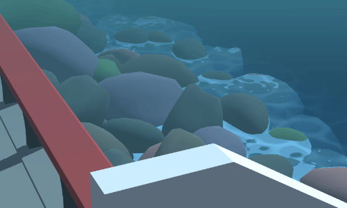

# the recorded data animations

On [today's stream](https://vods.exodrifter.space/2023/01/13/1818), I spent some time working on integrating a few animations into _the recorded data_ to make the various scenes more interesting.

- I wrote a vertex shader for the grass to make them wiggle a bit.
- I integrated the [Definitive Stylized Water](https://assetstore.unity.com/packages/vfx/shaders/definitive-stylized-water-87062) asset and made one of them very wavy.
- I used a particle system to make it RAIN (I like rain)

Hopefully @Titanseek3r and I can finish this game soon!
