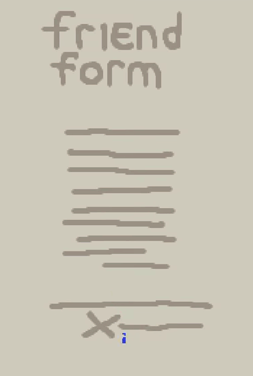

# signature animation

![A beige-colored document titled "friend form", with an animation of the names Berry, Lemon, and Rambu being signed on and disappearing before the next signature appears in the same place in sequence. The text on the document is not readable and is represented with simple dark brown lines. The bottom of the document has an "x" with a line next to it where Berry signs with blue, Lemon signs with green, and Rambu signs in red. As the signatures are drawn, the ink starts off dark but then transitions into a lighter color.](20231206-hero.gif)

One of the characters in _[null](20230915.md)_ wants to befriend others in the hospital, but they're too timid so they ask you to get others to sign an agreement to be a friend with them. I wanted the signatures to be animated, and I finally got around to implementing it [today](https://vods.exodrifter.space/2023/12/05/2225). It was a lot of fun to make!

It only uses one texture; this effect isn't done with an animated sprite. If you're interested in replicating this kind of effect as well, I've described briefly how it works below.

---

# the trick

The trick is to draw each signature in a gradient from white to black.

<div style="width:fit-content;margin:0 auto">


</div>

Essentially, we will use the color at each pixel to decide when to show that part of the signature. We can arbitrarily decide if we want to show white first or black first; in this case we want to show the white first since the beginning of the name starts with white.

As time progresses, we want to show more and more of the signature. So, we allow the nearly white colors in addition to white, then all of colors between white and grey, all of the colors between white and almost-black, and then finally all of the colors between white and black.

Because of how this approach works, if any of your strokes happen to overlap, you'll need to make sure you maintain the color of the part of the signature that needs to be drawn first. Otherwise, you'll end up with a gap in the signature when it's drawn. You basically need to draw the signature backwards.

# the shader

Once you have an appropriate texture, in Godot's shader language we can write a simple shader to do the animation:

```gdshader
shader_type canvas_item;

uniform float progress: hint_range(0.0, 1.0, 0.01);

void fragment() {
	float cutoff = 1.0 - progress;

	// We don't need to check all of the rgb components since we know
	// the original image is in grayscale; just checking one of the
	// components is enough.
	if (cutoff >= texture(TEXTURE, UV).r)
	{
		COLOR = vec4(0.0, 0.0, 0.0, 0.0);
	}
}
```

This shader gives you this result:

<div style="width:40%;margin:0 auto">


</div>

But the signatures are not terribly interesting in grayscale, so we can just ignore the color on the texture and draw our own color.

```gdshader
shader_type canvas_item;

uniform vec3 signature_color: source_color;
uniform float progress: hint_range(0.0, 1.0, 0.01);

void fragment() {
	float cutoff = 1.0 - progress;
	vec4 tex = texture(TEXTURE, UV);

	// Respect the modulated alpha from Godot. This was enough for
	// me, since I don't modulate anything other than the alpha, but
	// you may want to account for the other color channels.
	float a = COLOR.a * tex.a;

	if (cutoff < tex.r)
	{
		COLOR = vec4(signature_color, a);
	}
	else
	{
		COLOR = vec4(0.0, 0.0, 0.0, 0.0);
	}
}
```

<div style="width:40%;margin:0 auto">


</div>

And finally, when you use ink to sign a document you might notice that the ink starts off dark before it becomes lighter after drying. We can simulate this effect too, by coloring anything we drew recently in a darker color:

```gdshader
shader_type canvas_item;

uniform vec3 signature_color: source_color;
uniform float progress: hint_range(0.0, 1.0, 0.01);

vec3 lerp_vec3(vec3 a, vec3 b, float t)
{
	return a + t * (b - a);
}

void fragment() {
	// It's easier to think about adding another "0.1" to the progress
	// meter to accomodate the time for the drying effect, so we remap
	// our progress to the range [0, 1.1]. This allows us to continue
	// using the shader with typical [0, 1] weights.
	float cutoff = 1.0 - progress * 1.1;
	vec4 tex = texture(TEXTURE, UV);
	float a = COLOR.a * tex.a;

	if (cutoff < tex.r)
	{
		COLOR = vec4(signature_color, a);

		// Wet ink effect
		if (abs(cutoff - tex.r) < 0.1)
		{
			float t = abs(cutoff - tex.r) / 0.1;
			COLOR = vec4(lerp_vec3(COLOR.rgb * COLOR.rgb, COLOR.rgb, t), a);
		}
	}
	else
	{
		COLOR = vec4(0.0, 0.0, 0.0, 0.0);
	}
}
```

<div style="width:40%;margin:0 auto">



</div>

And there you have it, a nice little signature effect using a single texture.
